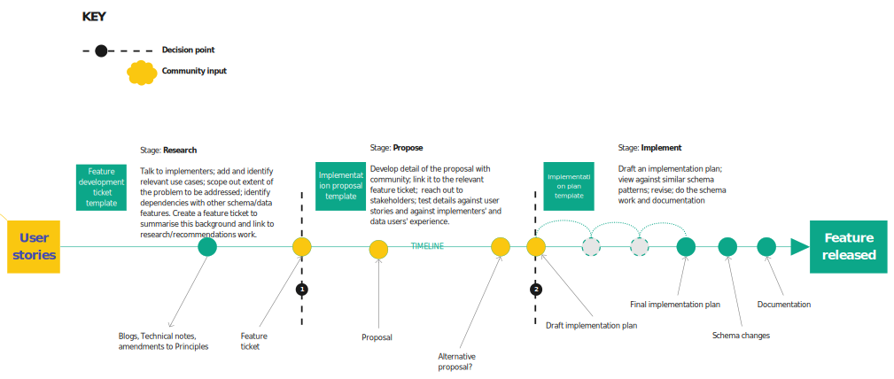

# Feature development in BODS

## Overview

Development of the Beneficial Ownership Data Standard (BODS) responds to the needs of those collecting, sharing and using the data. Those needs are evolving as the field of beneficial ownership transparency grows beyond the foundational policy work. Our new development pipeline aims to highlight the requirements that a feature will meet and how progress on developing the feature proceeds. We hope that this will make it easier for all stakeholders to contribute at the point that best suits them.

The [BODS Feature Tracker](https://github.com/openownership/data-standard/projects/4) gives an overview of progress along the pipeline.

Before a feature is considered for introduction to BODS, as the pipeline suggests, there has already been a lot of research. This may be requirements gathering, experience from supporting implementation of beneficial ownership registers, and thinking on the part of Open Ownership and others. The feature development ticket is the first time that all of that is gathered and presented as background for new developments in the standard.

**Links**: [BODS Feature Tracker](https://github.com/openownership/data-standard/projects/4)

## Feature development tickets

A ‘feature’ refers to a significant change or revision to the BODS schema or documentation (in contrast to small enhancements and bug fixes). Feature development tickets act as a kind of ‘parent ticket’ for work on a given element of BODS. Broadly, they are in the format of problem statements: they focus on the user-need gaps in BODS which need to be filled, and should not veer into proposing solutions (a template is provided when you add a new ticket to the repository). For example, see this feature development ticket about [representing state-owned enterprises](https://github.com/openownership/data-standard/issues/360).

It is crucial that feature tickets are written with a broad audience in mind. Those reading and commenting on these tickets may be policy-makers and regulators, beneficial ownership researchers, technical consultants, or developers. These tickets are placed on the [BODS Feature Tracker](https://github.com/openownership/data-standard/projects/4), under the relevant status column. They are moved across the tracker as work proceeds into its different phases.

The title of a feature development ticket should be 'Feature: XXXXX' where XXXXX is the feature name. The information in the first post on the ticket thread should be updated as necessary so that it holds up-to-date information. For example, when an implementation proposal is made for a particular feature (see below), this should be linked to from the ‘Feature work tracking’ section. Comments on the ticket can be used to help track high-level work towards this feature or to refine this set of information.

**Links**: [Create a feature development ticket](https://github.com/openownership/data-standard/issues/new/choose)  |  [Example of a feature development ticket](https://github.com/openownership/data-standard/issues/360)

## Implementation proposal tickets

Once the need for a new feature in BODS has been well-described in a feature development ticket, proposals can be made about how to implement the feature.

A [template](https://github.com/openownership/data-standard/issues/new/choose) exists for implementation proposals. You can see it in action for [state-owned enterprises here](https://github.com/openownership/data-standard/issues/363). The title of the GitHub ticket should be 'Implementation proposal: XXXXX no.Y' where XXXXX is the feature name in the linked ticket. Y will be 1, if this is the first proposal to address a feature. It is important to link back from the proposal to the ‘parent’ feature development ticket. The rest of the template is only a suggestion - you may need to veer away from it, depending on the feature.

It is important in a proposal to give enough information for people to understand the gist of the idea and its ramifications so that they can helpfully critique it. But there should not be so much detail that it obscures the salient points or that - in the event that there are flaws in the proposal and it is not implemented - time and effort is wasted.

People can comment on the proposal ticket, questioning, refining and developing the implementation proposal. Interactions and work on this ticket represent a collaborative process. Proposals may be paused, withdrawn, or developed into draft implementation plans. Update the 'Proposal status' as thinking progresses on this thread. Highlight changes or updates to the proposal within thread comments, with a clear 'Updated proposal' heading.

If there is an entirely different approach to implementing a feature in BODS, it may be appropriate to submit an alternative implementation proposal, in which case a new implementation proposal ticket should be created. It should - again - be linked back to the parent feature ticket. The proposal number in the new ticket title, Y, should be incremented to indicate that this is a new and separate implementation idea.

**Links**: [Create an implementation proposal ticket](https://github.com/openownership/data-standard/issues/new/choose)  |  [Example of an implementation proposal ticket](https://github.com/openownership/data-standard/issues/363)

## Drafting an implementation plan

Once the broad shape of an implementation proposal has been scrutinised, and agreed to be the optimal way of addressing a feature, an implementation plan can be drafted. The plan should specify as fully as possible the changes that will need to be made to the BODS schema and documentation. 

Depending on the nature of the feature, the plan might be specified in a document, GitHub ticket, spreadsheet or even a pull request. For that reason, we provide a guide template below, instead of in any particular format.

It may be the case that a draft implementation plan is worked on in parallel with a proposal under consideration. For example: in order to address concerns or questions raised about a proposal, it could be useful to work out some of the details of an implementation plan. However, this should not be taken as evidence that a proposal has been accepted for implementation.

TEMPLATE

**Implementation plan for: [FEATURE NAME]**

_[This file/document/ticket proposes precise changes to the BODS schema and documentation in order to implement a feature in the proposed way._

See [Feature development in BODS](https://openownership.github.io/bods-dev-handbook/feature_development.html) in the Handbook. ]

Feature ticket link #....

Proposal ticket link #....

Plan status: draft | near final | final

BODS schema changes:

BODS documentation. To-do list of edits:

## BODS release tracking 

Feature development is ongoing, and some features take longer than others to come to fruition. For that reason we have separated [feature development tracking](https://github.com/openownership/data-standard/projects/4) from BODS release tracking.

Feature development tickets will also be placed on the release tracker when appropriate, alongside bug fixes, enhancements and other developments.

**Links**: [BODS Feature Tracker](https://github.com/openownership/data-standard/projects/4)  |  [BODS release tracker](https://github.com/orgs/openownership/projects)

## Improving this feature development pipeline

As of October 2021, the feature development pipeline and above guidance is new. The work represents a move towards greater transparency and it will underpin improvements in the governance of the standard. 

There are allusions above to ‘agreement’ and ‘acceptance of proposals’. We currently have no formal process to support this. These ‘decision points’ in the pipeline will require oversight, consideration and process. Hence they will need to be built into the ongoing and future governance of the standard.

