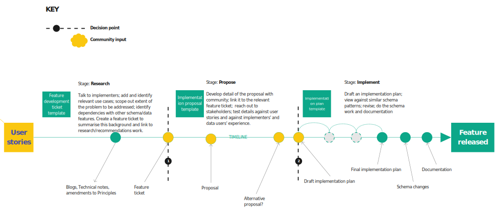

# BODS development and decision-making

## Overview

Development of the Beneficial Ownership Data Standard (BODS) responds to the needs of those collecting, sharing and using the data (the community). Those needs are evolving as the field of beneficial ownership transparency grows beyond the foundational legislative work. The development pipeline demonstrates the requirements that a feature will meet and how progress on developing the feature proceeds. We hope that this clarity will make it easier for all stakeholders to contribute at the point that best suits them.

The [BODS Feature Tracker](https://github.com/openownership/data-standard/projects/4) gives an overview of progress along the Feature development pipeline. 

[BODS release tracking](#bods-release-planning-and-tracking) has been separated from Feature development tracking, since the latter can be ongoing and some features take longer than others to come to fruition.

The [Governance page](https://standard.openownership.org/en/latest/about/governance.html) on the BODS website provides a summary of the information on this page.

**Links**: [BODS Feature Tracker](https://github.com/openownership/data-standard/projects/4)

## Feature development tickets

A ‘feature’ refers to a significant change or revision to the BODS schema or documentation (in contrast to small enhancements and bug fixes). Before a feature is considered for introduction to BODS, as the pipeline suggests, there has already been a lot of research. This may be requirements gathering, experience from supporting implementation of beneficial ownership registers, and thinking on the part of Open Ownership and others. The feature development ticket is the first time that all of that is gathered and presented as background for new developments in the standard. Feature development tickets will most often be added by the technical maintainer of the data standard, in response to needs expressed by the community. (Anyone may [make a feature request](https://github.com/openownership/data-standard/issues/new/choose) for the initial consideration of the community.)

Feature development tickets act as a kind of ‘parent ticket’ for work on a given element of BODS. Broadly, they are in the format of problem statements: they focus on the user-need gaps in BODS which need to be filled, and should not veer into proposing solutions. To support this focus, a template is provided when you add a new ticket to the repository. For example, see this feature development ticket about [representing state-owned enterprises](https://github.com/openownership/data-standard/issues/360).

It is crucial that feature tickets are written with a broad audience in mind. Those reading and commenting on these tickets may be policy-makers and regulators, beneficial ownership researchers, technical consultants, or developers. These tickets are placed on the [BODS Feature Tracker](https://github.com/openownership/data-standard/projects/4), under the relevant status column. They are moved across the tracker as work proceeds into its different phases.

The title of a feature development ticket should be 'Feature: XXXXX' where XXXXX is the feature name. The information in the first post on the ticket thread should be updated as necessary so that it holds up-to-date information. For example, when an implementation proposal is made for a particular feature (see below), this should be linked to from the ‘Feature work tracking’ section. Comments on the ticket can be used to help track high-level work towards this feature or to refine this set of information.

**Links**: [Create a feature development ticket](https://github.com/openownership/data-standard/issues/new/choose)  |  [Example of a feature development ticket](https://github.com/openownership/data-standard/issues/360)

## Implementation proposal tickets

Once the need for a new feature in BODS has been well-described in a feature development ticket, anyone can make a proposal about how to implement the feature.

A [form](https://github.com/openownership/data-standard/discussions/new?category=feature-implementation) exists for implementation proposals. You can see an implementation proposal for [state-owned enterprises here](https://github.com/openownership/data-standard/issues/363). The title of the GitHub discussion should be 'Implementation proposal: XXXXX' where XXXXX is the feature name in the linked ticket. It is important to link back from the proposal to the ‘parent’ feature development ticket.

It is important in a proposal to give enough information for people to understand the gist of the idea and its ramifications so that they can helpfully critique it. But there should not be so much detail that it obscures the salient points or that - in the event that there are flaws in the proposal and it is not implemented - time and effort is wasted.

If there is an entirely different approach to implementing a feature in BODS, it may be appropriate to submit an alternative implementation proposal. In this case, a new implementation proposal ticket should be created. It should - again - be linked back to the parent feature ticket. The titles of alternative implementation proposals for the same feature should be edited to clearly distinguish them (for example, by adding the suffixes "(option 1)" and "(option 2)").

**Links**: [Create an implementation proposal ticket](https://github.com/openownership/data-standard/issues/new/choose)  |  [Example of an implementation proposal ticket](https://github.com/openownership/data-standard/issues/363)

## Checking for broad consensus on an implementation proposal

People can comment on proposal tickets, questioning, refining and developing the implementation proposal. Interactions and work on such tickets represent a collaborative process. Proposals may be paused, withdrawn, or developed into rough implementation plans. Update the 'Proposal status' as discussion progresses. Highlight changes or updates to the proposal within thread comments, with a clear 'Updated proposal' heading.

Once refinement of the proposal has taken place, community members should be given at least two weeks to review the updated proposal. This final period of consultation should have a clear deadline.

If responses during this time indicate that there is not broad consensus about proceeding with implementation as proposed, the proposal will be suspended. Otherwise, the consensus will be noted and the implementation phase can begin.

## Drafting an implementation plan

Once the broad shape of an implementation proposal has been scrutinised, and agreed to be the optimal way of addressing a feature, an implementation plan can be drafted by the Technical maintainer of the data standard. The plan should specify as fully as possible the changes that will need to be made to the BODS schema and documentation. And it should be available for interested members of the community to see. Transparent planning should provide a solid basis for subsequent work on the schema and documentation. 

Depending on the nature of the feature, the plan might be specified in a document, GitHub ticket, spreadsheet or even a pull request. For that reason, we provide a guide template below, instead of in any particular format.

It may be the case that a draft implementation plan is worked on in parallel with a proposal under consideration. For example: in order to address concerns or questions raised about a proposal, it could be useful to work out some of the details of an implementation plan. However, this should not be taken as evidence that a proposal has been accepted for implementation.

TEMPLATE

**Implementation plan for: [FEATURE NAME]**

_[This file/document/ticket proposes precise changes to the BODS schema and documentation in order to implement a feature in the proposed way._

See [Feature development in BODS](https://openownership.github.io/bods-dev-handbook/feature_development.html) in the Handbook. ]

Feature ticket link #....

Proposal ticket link #....

Plan status: draft | near final | final

BODS schema changes:

BODS documentation. To-do list of edits:

## BODS release planning and tracking 

Alongside new or revised features, a new version of BODS may include bug fixes and minor enhancemnets and edits. In preparation for a new round of development which will culminate in a new version of BODS, the Technical maintainer will create a release tracker (a GitHub project). They and the Stewarding organisation will draft onto the tracker the features, bug fixes, changes and updates which they propose are implemented in the new version. This proposed prioritisation will be announced via GitHub and other relevant channels.

Community members will have at least two weeks to review the release tracker and suggest any changes. Broad consensus will be sought during the review period, with changes being made to the release tracker where necessary. Once broad consensus is reached, work on the prioritised issues will proceed.

**Links**: [BODS Feature Tracker](https://github.com/openownership/data-standard/projects/4)  |  [Example release tracker - BODS v0.4](https://github.com/orgs/openownership/projects/4/views/1)

## Further improvement of development and decision-making processes

This page was first created in October 2021 and revised in March 2026. The Stewarding organisation and Technical maintainer aim to meet the [OpenStand principles of standard development](https://open-stand.org/about-us/principles/).

As of March 2026, BODS is not in active development.

We refer above to 'broad consensus' amongst the community of BODS users when it comes to decision points in development plans. If the community becomes large enough to warrant a further round of BODS development, this scale will make development of 'broad consensus' in a direct way unmanageable. Further updates to the governance of the standard will be required. These are likely to include:

1. **Developing standard governance roles**. For example, building out a steering committee, responsible for oversight of governance processes and for approving updates and revisions to the standard.
2. **Updating the revision process**. Evolving and refining this development and decision-making process.
3. **Developing a contributor code of conduct**. Reviewing the [old Data Standard Working Group Values](https://standard.openownership.org/en/0.3.0/about/governance.html#values) and updating them with a clear scope of application.
4. **Developing a statement regarding design principles**. Capturing the design principles that have shaped and should shape BODS.

