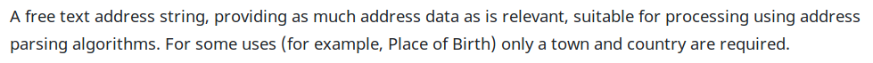
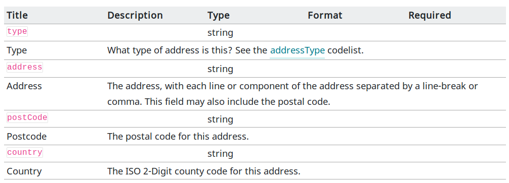
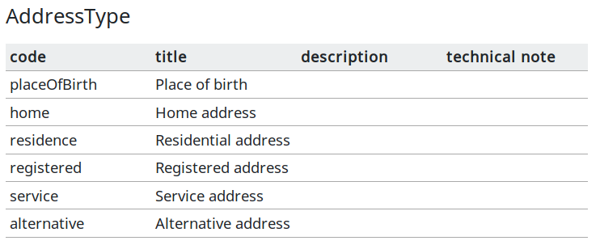

# BODS Style Guide - #draft

This style guide is a draft to be discussed and not yet implemented across the BODS schema and documentation (as of May 2019, BODS v0.2). It can be used to guide editing and content writing. The Guide is divided into separate, though related, sections: one for the BODS schema and one for the BODS documentation.

## BODS Schema

- Object and property names, and definition entry names to be camelCase, e.g. interestedParty

- Object and property titles: first word to be uppper case. E.g. 'Interest' or 'Ownership-or-control statement'.

- In descriptions, properties should be referred to by their property name in backquotes. E.g. \`id\` is required.

**WIP notes**

*Codelist codes? Currently most multi-word codes are camelCase (e.g. placeOfBirth). However in the unspecifiedReason and interestType codelists - and poss others - hyphens are used (e.g. information-unknown-to-publisher). We need to introduce some consistency.*

*Adapt and adopt [OCDS style guidance for property descriptions](https://ocds-standard-development-handbook.readthedocs.io/en/latest/meta/schema_style_guide.html#field-and-code-descriptions) ?

*Markup within descriptions?*

## BODS documentation

restructuredText (.rst) files are used to document BODS. 

- Properties to be referred to by their property name (not title) and marked up as \`\`propertyName\`\`. This can be used to refer to the property and its value. Or it can be used as a shorthand for the property value.

- Objects to be referred to by their title, e.g. '... the Interested Party object has a number of required properties...'

- Statements to be referred to by their titles. e.g. "The details of the company are entered into an Entity Statement"

**WIP notes**

*How should a codelist be referred to? I suggest by its inferred title, capitalised. e.g. "...choose an item from the Unspecified Reason codelist...". And it would be translated for internationalisation.*

*How should a code be referred to? By its code or by its title? If by code, this wouldn't be translated. Perhaps use single quotes (e.g. "...use 'placeOfBirth' to refer to an address...") Then translation guidance could instruct translators to retain the code in the text but follow it with the translated code title (e.g. "... utilise 'placeOfBirth' (lieu de naissance) pour faire référence à une adresse...". Similar guidance would work for dealing with property names in translation (see above).* 

*Should we use 'object' or 'block' or even 'component' to refer to JSON objects?*

### Embeddeding schema objects

We use various plugins to embed schema and codelist elements in dynamic ways.

[JSONValue](https://github.com/openownership/data-standard/blob/3766d9a55b61d2b1b5f27c37dfd5fd24f1cc9884/docs/conf.py#L186) (in the docs `conf.py`) to pull out the value of one key in the JSON, e.g.:

```
.. json-value:: ../_build_schema/components.json
   :pointer: /definitions/Address/description
```



[JSONSchema](https://github.com/OpenDataServices/sphinxcontrib-jsonschema) (a Sphinx extension) to make a table of multiple key-value pairs from the JSON, e.g.:

```
.. jsonschema:: ../_build_schema/components.json
   :pointer: /definitions/Address
   :externallinks: {"type":{"url":"#addresstype","text":"Codelists"}}
```



[CSVTable](http://docutils.sourceforge.net/docs/ref/rst/directives.html#csv-table) (a builtin Sphinx directive) to make a table from codelist csv files, e.g.:

```
.. csv-table::
   :header-rows: 1
   :class: codelist-table
   :file: ../_build_schema/codelists/addressType.csv
```




### RST usage

**DO NOT** use this directive to embed HTML elements in the docs. (Encompassed strings will not be picked up for translation.)

```
.. raw:: html

    <h2>
        Background
    </h2>
```
