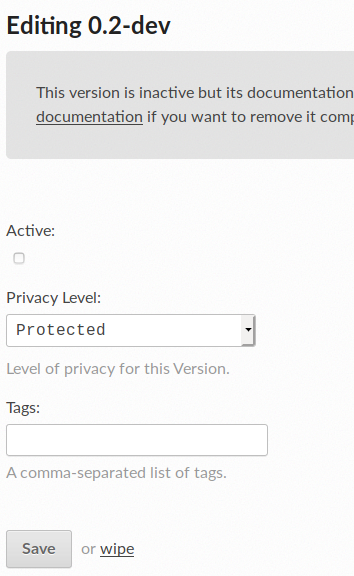

# Translations

The processes, roles and mechanisms detailed below implement the [BODS Language Support Policy](https://docs.google.com/document/d/1E15uIOO_JRU2_hFvetaMu4L66hJSrJMuK1U0lenDiyA).

Note: This process is still in development, and improvements or clarifications are welcome.

The following instructions cover the translation of:

* A version of the Beneficial Ownership Data Standard (BODS) **schema**, including its **codelists**
* The corresponding **documentation** website
* The documentation website’s **theme**

## Locations of source files to be translated

BODS **schema** and **codelists** exist under the [schema folder within the BODS Github repository](https://github.com/openownership/data-standard/tree/main/schema).
The content for the BODS **documentation** website exists under the [docs folder within the same BODS Github repository](https://github.com/openownership/data-standard/tree/main/docs).
The documentation website’s **theme** has its own Github repository - [data-standard-sphinx-theme](https://github.com/openownership/data-standard-sphinx-theme).

By translating the three components listed above the publicly available website at https://standard.openownership.org can be published in different languages. This is the aim of the translation work.

## Scope of translation work

Things that are in scope for translation are:

* All prose in the **documentation**.
* Text such as menu items and footers in the **documentation theme**.
* The *values* of **schema** fields `title` and `description`.
* The *values* of **codelist** fields `title`, `description` and `technical note`.
* The SVG diagrams in the **documentation**.

Things that are not in scope for the translation are:

* The *names* of **schema** objects
* The *values* of **schema** fields `type` and `required`
* The *names* of **codelist** objects

Things that need to become part of the translation workflow but are not yet:

* The example data in the [data-standard repo](https://github.com/openownership/data-standard).

## Overview of the translation workflow

The workflow for doing the translation is:

* extract the strings that need to be translated from the repositories
* push the strings up to their Transifex project
* have the strings translated, reviewed and proofread
* pull the translated strings down from Transifex
* upload them to their respective repositories and
* make them live on the website.

The diagram below provides an extremely high-level overview of the workflow. It excludes the final step of making the translation live.


## BODS on Transifex

BODS translations currently live under the [Open Data Services Transifex account](https://www.transifex.com/OpenDataServices/). The BODS docs and schema live in [BODS-main](https://www.transifex.com/OpenDataServices/bods-main) (for the latest in-development version), or versioned projects (for versioned releases of the standard), e.g. v0.1 'project' is [bods-v01](https://www.transifex.com/OpenDataServices/bods-v01/dashboard/). The project contains 'resources', each of which correspond to a page of documentation (an individual RST file) plus one each for the schema, codelists and .svg files. These may also be referred to as 'source files'.

The documentation sphinx theme translations live under [bods-theme](https://www.transifex.com/OpenDataServices/bods-theme/dashboard/), which contains only one resource for all the strings in the theme templates.

## Setting up your local machine

Complete the following steps to get your system set up to undergo the workflow outlined above (assumes Ubuntu 18.04.2 LTS or similar):

* set up an account and join the ODSC organization in Transifex
* clone the repositories to manage the workflow
* install and configure the Transifex client

### Setting up an account and joining the ODSC organization in Transifex

Create a free Transifex account on their [sign up page](https://www.transifex.com/signup/).

The organization is the home of all the translation projects that an organization runs on Transifex.

Open Data Services Co-operative is already set up as an organization in Transifex and all of our projects and teams are managed from within it. A list of our translation projects is visible at the [Open Data Services Co-operative public page](https://www.transifex.com/OpenDataServices/public/).


Once you have signed up to Transifex you should ask an administrator of ODSC to make you an administrator too. We don't maintain a list of those administrators here, but there is a considerable overlap with the [people who contribute towards the BODS Standard repository](https://github.com/openownership/data-standard/graphs/contributors).

### Cloning the repositories to manage the workflow

Follow the instructions in the [BODS data-standard-sphinx-theme README.md](https://github.com/openownership/data-standard-sphinx-theme). These instructions will clone both the data-standard-sphinx-theme and data-standard repositories to your local machine.

If you already have the repositories, make sure you pull the most up to date version of the branch you're working on, and have updated the requirements.

### Installing and configuring the Transifex client

#### Installing the Transifex client

Transifex offers a number of different options for uploading content to be translated. In this documentation we will describe the process for setting up the Command Line Interface (CLI) Client.

At the commandline, you can install the lastest version of the client by running:

```
curl -o- https://raw.githubusercontent.com/transifex/cli/master/install.sh | bash
```

For other methods of installing, or to get a specific version of the client, follow the [instructions for installing the Transifex client for your system here](https://github.com/transifex/cli/blob/devel/README.md).

#### Installing other dependencies

You also need to make sure you have `gettext`, `pybabel` and (for SVGs) `itstool` installed in whatever environment you're running this in:

```
$ apt-get install gettext
$ apt-get install python3-babel
$ apt-get install itstool
```

#### Configuring the Transifex client

Transifex configuration involves the creation of two files:

`~/.transifexrc`, which stores your Transifex host configuration in your home directory, including your API key.
`.tx/config`, which stores the mappings between your local files and Transifex in a .tx folder in your repo’s root directory.

Transifex’s own documentation for initialising the client involves running the tx init command. We are going to edit the files more directly.

##### Creating and storing your API key

You'll need a [Transifex API key](https://www.transifex.com/user/settings/api/) to push to and pull from the BODS project. Click on the “Generate a token” button on the right hand side. Click on “Copy and Close”. Your API token has been created.  You only need this locally; don't commit it or share it or store it anywhere public.

So you don't have to enter it at the commandine every time you can store it in `.transifexrc` in your home directory (`~/`), which looks like:

```
[https://www.transifex.com]
api_hostname = https://api.transifex.com
hostname = https://www.transifex.com
password = YOUR-API-KEY-SHOULD-GO-HERE
username = api
```
Enter the lines as shown above, replacing YOUR-API-KEY-SHOULD-GO-HERE with your newly generated api key.

This sets you up with access to add and retrieve files to and from Transifex. See [Transifex client configuration](https://docs.transifex.com/client/client-configuration) for more details.

##### .tx/config

The `.tx/config` file is used to map files in a local repo/directory to resources in Transifex. This file is stored in the .tx folder in the repo’s root directory.

Although it is possible to pre-configure your `.tx/config` file in advance there are number of ways in which the configuration can change, right up until the moment that you extract and push your projects’ strings up to Transifex. In particular, the `.tx/config` file maps:

  * the Transifex project that you are pushing strings to and then pulling the translated strings from
  * the files in the repositories that strings are extracted from (see [data-standard](https://github.com/openownership/data-standard)). This can be dependant upon the branch of the repo that you have checked out.

For that reason, we often recreate the .tx/config file as part of the workflow.

The diagram below shows the state of the .tx/config file after extracting the strings from the 0.3 dev branch of the data-standard repo, ready to push those strings up to the BODS v0.3 project on Transifex.


Instructions to create an initial `.tx/config` file are provided [below](#translation-workflow).


## Integrating translations

Whenever any strings are changed that are in scope for translation (see list above) they need to be 'extracted', pushed to Transifex, translated, and the translated strings pulled back down. Updates to the documentation and schema should not be released until the necessary translations are in place.

The steps for doing this should be done by the person making the changes to the schema and docs, and are documented [below](#translation-workflow). There are separate steps for the docs, schema and codelists, and you only need to carry out the steps applicable to the changes you made. For example, if you only updated the schema, you don't need to execute commands to extract strings from the docs or codelists.

If you are working on a development branch, you **should not** push source file changes to Transifex. Instead, wait until your changes have been merged into the main branch. **Source files should only ever be pushed to Transifex from the main branch** (currently `main`) to ensure conflicts do not occur in Transifex between multiple people working on different branches simultaneously.

Note that 'extracted' (English) strings (`.pot` files) are not pushed to the Github repo, but translated strings (`.po` files) are. This lets readthedocs find them so it can build everything in other languages. For a clean commit history, it's helpful to make separate commits for your changes to the source (docs or schema) and the translation files subsequently pulled from Transifex.

The steps for the Sphinx theme are in the [sphinx theme README](https://github.com/openownership/data-standard-sphinx-theme#translations).

Note for developers: `.po` files from the Sphinx theme are included when you build the docs from `data-standard` thanks to the following line in `docs/conf.py`:

```
locale_dirs = ['locale/', os.path.join(oods.sphinxtheme.get_html_theme_path(), 'locale')]
```

So make sure the latest version of the theme is being installed in case expected translations aren't showing up.

### Creating and configuring a new project in Transifex

Translations for the current latest version of BODS are found in the [BODS-main Transifex project](https://www.transifex.com/OpenDataServices/bods-main). These may not be updated until it is time for a new versioned release of BODS, meaning translations in Transifex may be lagging behind the latest text in the BODS Github repository. However, when changes to the docs, schema or codelists are merged into the main branch, these changes should always be pushed to Transifex, so that - assuming translators are available - translations can be brought up to date at any time. See [integrating translations](#integrating-translations).

If you need to create a new Transifex project that contains the latest available source files and translations, do the following:

* [Add a new project on Transifex](https://www.transifex.com/OpenDataServices/add/).
* If applicable, name it according to the version of BODS, e.g. `bods-v02` for BODS version 0.2.
* Choose 'public project' and **make sure to check the 'My project is a non-commercial Open Source project checkbox'** and enter the Github repo URL.
* 
* Assign the project to the BODS team.
* Under the 'Workflow' tab choose "Translation Memory Fill-up" under "Pre-translation".
* 
* Make sure you have the latest translations and source files in your local environment (see the [translation workflow](#translation-workflow).
* Update the Transifex config to use the Transifex project that you just created (see the [translation workflow](#translation-workflow)). Commit this change if you want all subsequent updates to the branch you are on to use the new Transifex project.
* Run `tx push -s` to push the source files to Transifex.
* Run `tx push -t` to push the translation files to Transifex.
  * Transifex only lets you push translations if it detects yours are newer than what it already has, but sometimes this fails - especially if you are pushing to an empty project. You can force it to accept translations from your local environment with `tx push -t -f` - you will have to confirm (press `y` and <enter>) each file by hand. Note that this will override anything already in Transifex, so make sure yours really are the latest.

### Translation workflow

To run the steps in the translation workflow, ensure that you have followed the installation and setup instructions above.

Run the following commands from the root directory unless otherwise specified (eg. sometimes it's less complicated to run them from `docs`).

0. *Before you start*, run `tx pull -a` to make sure you have the most up to date translations in your local environment.

**When you change text in the docs** you need to do the following so that they can be translated:

* From the `docs` directory, run `make gettext` to extract translatable English strings from the docs. (This generates `.pot` files into `docs/_build/gettext/`.)

**If you modified the schema** also:

* Run `pybabel extract -F babel_bods_schema.cfg . -o docs/_build/gettext/schema.pot` to extract translatable English strings from the schema.

**If you modified the codelists** also:

* Run `pybabel extract -F babel_bods_codelist.cfg . -o docs/_build/gettext/codelist.pot` to extract translatable English strings from the codelists.
* If you change (add, remove, rename) a column heading in a codelist CSV, you must also edit the `babel_bods_codelist.cfg` file to match.

**If you modified an SVG diagram** also:

* Run `itstool -i svg-its-rules.xml -o docs/_build/gettext/svg.pot docs/_assets/*.svg` to extract translatable English strings from the SVGs.

**If you added, deleted or renamed** files or you want to use a **different Transifex project**, run (from root, ie. `cd ../`):

```
rm -f .tx/config
sphinx-intl create-txconfig
sphinx-intl update-txconfig-resources --pot-dir docs/_build/gettext --locale-dir docs/locale --transifex-organization-name OpenDataServices --transifex-project-name bods-test
```

(Replacing `bods-test` with a different Transifex project name.)

And then:

3. Run `tx push -s` to **push to Transifex**.

Now the files are ready to be translated in Transifex.

4. **To fetch new translations** when they're done, you need to run `tx pull -a` to fetch all, or `tx pull -l ru` to fetch a particular language.

5. If you are still on the main branch, check out a new development branch from which you will make a PR with the updated translations. **Commit** the new or updated .po files in `docs/locale`.

6. **Build translated SVGs** for each language using itstool, and commit these (because we can't easily install itstool on readthedocs):

```
pybabel compile --use-fuzzy -d docs/locale -D svg
```

Replacing <LANG> with language code, eg, `ru` (run this once per language):

```
itstool -m docs/locale/<LANG>/LC_MESSAGES/svg.mo -o docs/_build_svgs/<LANG> docs/_assets/*.svg
```

7. **Make a PR** with the new translation files and SVGs (if applicable).

### Teams and Roles

Teams are the groups of people who do the translations. Each project has just one team allocated to it, although a team can be allocated to more than one project. To illustrate this, below is a diagram showing the first ten projects listed under Open Data Services Co-operative (as at 2019-06-19) and the teams that are allocated to them.


A team can consist of the following roles:

  * A team manager
  * A team coordinator
  * Translators
  * Reviewers

The BODS team consists of a team manager, translators and reviewers, with the team manager taking on the role of coordinator. We also use subject matter experts to maintain the glossary. They do not have to use Transifex. Their work can be done in a spreadsheet that is uploaded to Transifex by the team manager. In the future we intend to host the glossary in the data-standard repository.

The BODS team manager allocates the translators and reviewers to a specific language. As at the time of writing we have only set up a team consisting of the [Members translating to Russian](https://www.transifex.com/OpenDataServices/teams/95583/ru/).


NOTE: The [OCDS handbook](https://ocds-standard-development-handbook.readthedocs.io/en/latest/standard/translation/workflow.html) specifies different roles. It separates out the "team manager" role into a "Release Manager" and a 'coordinator'. We should review these two different ways of working to see if we can agree a common standard. It also details a proofreader role which is not supported under the Transifex free plan.

#### Team manager

Tasks:
  * Create the project
  * Co-ordinate the freeze on further development of the branch being translated
  * Push strings to be translated up to Transifex
  * Co-ordinate the work of the translators and reviewers
  * Pull translated and quality tested strings down from Transifex
  * Publish translated website using Read The Docs

Therefore they need:

Skills:
  * To have an understanding of how Github works
  * To understand and be able to manage the translation process in Transifex
  * To understand and be able to manage organisations and teams in Transifex
  * To be able to use the tooling to extract strings from the repositories
  * To be able to push and pull extracted strings to and from Transifex
  * To be able to add and update a translation of the website in Transifex

#### Translator

Tasks:
  * Translate the strings in Transifex from the source language (by default, English) into the target language

Therefore they need:

Skills:
  * To be native speakers of the target language and fluent in English (the source language)
  * To be confident in using, or learning to use, Transifex.

#### Reviewer

Tasks:
  * Review the translated strings in Transifex and provide feedback to translators and the team manager

Therefore they need:

Skills:
  * To be native speakers of the target language and fluent in English (the source language)
  * To have extensive experience of talking and writing about beneficial ownership in the target language
  * To be confident in using, or learning to use, Transifex
  * To have a pragmatic approach to translation, taking into account the wider context in which it may be used

#### Subject matter expert

Tasks:
  * Translate beneficial ownership terms from the glossary's source language into the target language, in an online spreadsheet (a Google sheet).
  * Make notes in that same spreadsheet about the selection or use of any particular terms. (For use by translators.)
  * Answer terminological queries from translators, if they come up.

Therefore they need:

Skills:
  * To be native speakers of the target language and fluent in English (the source language).
  * To have extensive experience of talking and writing about beneficial ownership in the target language.
  * To be confident in using, or learning to use, Google sheets.

### Access for translators

Translators should be given access to translate the main BODS project (documentation, schema, codelists), as well as the theme.

Translators and reviewers can follow the instructions here to sign up to Transifex: [Transifex docs for translators](https://docs.transifex.com/getting-started-1/translators).

Once a translator or reviewer has signed up to Transifex then an admiinistrator can add them to the BODS Team through the [BODS team > Members translating to Russian](https://www.transifex.com/OpenDataServices/teams/95583/ru/) page. Clicking on "Add translators" or "Add reviewers" will bring up this form


which can be completed to add the person to the project

### Instructions for translators

Translators should be given access to the project on Transifex and also a link to the latest version of the data standard website for context. 

Translators do not have to translate every word in the Transifex project. Any text wrapped in \`s (e.g. \`address\`, \`JSON document <https://tools.ietf.org/html/rfc8259>\`) should not be translated. Special attention to this should be paid in the schema, schema-reference and concepts resources where they are used most. In the svg resource the names of objects and codes from a codelist are not to be  translated. As a guide a link to a translated version of the Key Concepts page should be provided (e.g. https://standard.openownership.org/es/latest/schema/concepts.html).

#### The translation and review process

NOTE: This section describes a process that is different to how we have worked to date. As such it should be seen as a suggestion that is open to discussion.

##### Translators

Once the strings for the schema release have been uploaded to Transifex, the translator should be given access to the project and asked to begin the translation.

Translators should be aware that they will be required to take part in the review of their work. Details of this are in the following section.

##### Reviewers

There are two inter-linked tasks for a reviewer. A reviewer can choose to do these separately or together as they work through the project.

1. Review all of the translated strings in the project
2. Check all of the warnings* against the translated strings in the project

*Transifex will warn users when certain translation checks fail. This includes cases when a term in the source file is translated to something other than the translation in the glossary.

Reviewers should make comments against the translation that are then resolved between them and the reviewer.

Comments are made against a string. Because a string can consist of an entire paragraph it is necessary to quote the part of the string that a comment is made against. Because a reviewer might query more than one part of the string it is necessary to create a reference for the comment.

A comment template is as follows:

```
#1 "selection-of-text-being-commented-on"
- Description of the problem that the reviewer sees in the translation
- Suggestion how this can be resolved
```

The translator can then accept the suggestion by editing the translated string or they can reply to the reviewer with an alternative suggestion or a request for clarification.

A template for a response to a comment is as follows

```
#1 "selection-of-text-being-commented-on"
- Response to the comment
```

##### Resolving differences
Where agreement cannot be reached by the translator and the reviewer it is the Team Manager's role to decide what should be done. They may take a decision themselves, or seek external advice.

## Adding new languages on readthedocs

Once you've got all your translations, you need to publish them. The process for adding a new language version of the docs on readthedocs is as follows.

* Go to your [readthedocs dashboard](https://readthedocs.org/dashboard) and click 'Import a Project', then 'Import manually' to the right.
  * You probably want to name it something like "Beneficial Ownership Data Standard (LANG)"
  * The Github URL is the base BODS repo, https://github.com/openownership/data-standard
  * Check the box for 'edit advanced project settings'
* Choose the language under Project Extra Details. The rest of the fields are intuitive, or have the right defaults.
* Go to Admin > Versions to activate any of the branches you need other than main. These should probably be the same ones as you have active in the main BODS readthedocs project, so the menus are consistent when the user switches language.
* Go to Builds to make sure the branch you need builds correctly. If it fails on a branch that the English version passes this is likely an indication that some translation files are missing. You can also preview it by clicking 'view docs'.
* Go back to the main (English) [BODS project](https://readthedocs.org/projects/beneficial-ownership-data-standard/). In Admin > Translations, choose the new project you just created from the Project dropdown:
  * 
* The new language should now appear as an option in the readthedocs flyout menu for all versions of the HTML documentation.

These instructions were summarised from [Localization of Documentation](https://docs.readthedocs.io/en/stable/localization.html) in the readthedocs docs.

## Previewing on readthedocs

When work is in progress on a branch, you can build this branch in readthedocs to preview it before publishing.

* Push local changes and translations to your in-progress branch Github.
* Go to the readthedocs project for the particular language version of the docs you want to preview.
* If you have never built this branch before, you need to nudge readthedocs into seeing it; build any other branch, e.g. latest:
  * 
* Go to Versions on the main menu. Find your branch on the list of inactive branchs and click Edit on the right.
  * 
* Check 'Active' and set the dropdown to 'Protected' (this means the URL will work for sharing, but it won't appear in the versions menu):
  * 
* Go to Builds. Your new branch should have already built automatically and appear at the top of the list, but if it hasn't you can choose it from the dropdown and click 'Build'. You can see the results by clicking on the latest build:
  * 
* You can preview it by clicking the green 'view docs' button in the top right.
* You can rebuild it from the dropdown at the top of the Builds page every time you push new changes to Github.
* Don't forget to switch it off when you're done in Admin > Versions.

## Additional resources

* [Using Transifex (OCDS docs)](https://ocds-standard-development-handbook.readthedocs.io/en/latest/standard/translation/using_transifex/)
* [OCDS translation workflow](https://ocds-standard-development-handbook.readthedocs.io/en/latest/standard/translation/workflow/)
* [OCDS technical implementation of translation](https://ocds-standard-development-handbook.readthedocs.io/en/latest/standard/translation/implementation/)
* [Readthedocs translation workflow](https://docs.readthedocs.io/en/stable/guides/manage-translations.html)
