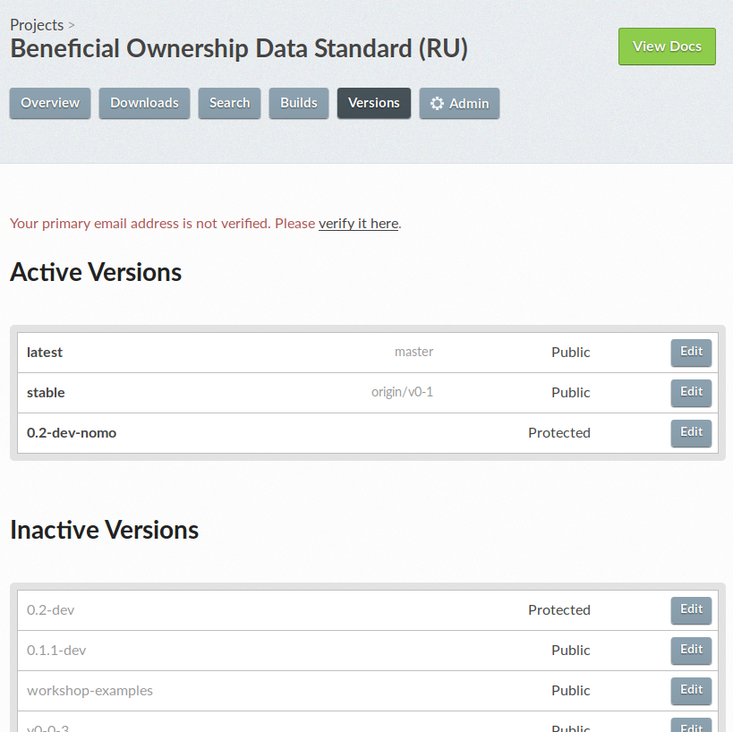

# Translations

The processes, roles and mechanisms detailed below implement the [BODS Language Support Policy](https://docs.google.com/document/d/1E15uIOO_JRU2_hFvetaMu4L66hJSrJMuK1U0lenDiyA).

Note: This process is still in development, and improvements or clarifications are welcome.

Things that are in scope for translation are:

* All prose in the documentation.
* Text like menu items and footers in the documentation theme.
* The *values* of schema fields `title` and `description`.
* The *values* of codelist fields `title`, `description` and `technical note`.

Things that need to become part of the translation workflow but are not yet:

* The example data in the [data-standard repo](https://github.com/openownership/data-standard).
* The SVG diagrams in the documentation.

## Roles

### Subject matter expert

Tasks:
* Translate beneficial ownership terms from the glossary's source language into the target language, in an online spreadsheet (a Google sheet).
* Make notes in that same spreadsheet about the selection or use of any particular terms. (For use by translators.)
* Answer terminological queries from translators, if they come up.
Therefore they need:

Skills:
* To be native speakers of the target language and fluent in English (the source language).
* To have extensive experience of talking and writing about beneficial ownership in the target language.
* To be confident in using, or learning to use, Google sheets.

## Integrating translations

Whenever any strings are changed that are in scope for translation (see list above) they need to be 'extracted', pushed to Transifex, translated, and the translated strings pulled back down. Updates the documentation and schema should not be deployed until the necessary translations are in place.

The steps for doing this should be done by the person making the changes to the schema and docs, and are documented in the [data standard README](https://github.com/openownership/data-standard/blob/master/README.md). There are separate steps for the docs, schema and codelists, and you only need to carry out the steps applicable to the changes you made. For example, if you only updated the schema, you don't need execute commands to extract strings from the docs or codelists.

The steps for the Sphinx theme are in the [sphinx theme README](https://github.com/openownership/data-standard-sphinx-theme#translations).

Note that 'extracted' (English) strings (`.pot` files) are not pushed to the github repo, but translated strings (`.po` files) are. This lets readthedocs find them so it can build everything in other languages. For a clean commit history, it's helpful to make separate commits for your changes to the source (docs or schema) and the translation files subsequently pulled from Transifex.

Note for developers: `.po` files from the Sphinx theme are included when you build the docs from `data-standard` thanks to the following line in `docs/conf.py`:

```
locale_dirs = ['locale/', os.path.join(oods.sphinxtheme.get_html_theme_path(), 'locale')]
```

So make sure the latest version of the theme is being installed in case expected translations aren't showing up.

## BODS on Transifex

BODS translations currently live under the Open Data Services Transifex account. The BODS docs and schema live in versioned projects, ie. v0.1 'project' is [bods-v01](https://www.transifex.com/OpenDataServices/bods-v01/dashboard/). The project contains 'resources', each of which correspond to a page of documentation (an individual RST file) plus one each for the schema and codelists.

The documentation sphinx theme translations live under [bods-theme](https://www.transifex.com/OpenDataServices/bods-theme/dashboard/), which contains only one resource for all the strings in the theme templates.

### Access for devs/analysts

You'll need a [Transifex API key](https://www.transifex.com/user/settings/api/) to push to and pull from the BODS project. You only need this locally; don't commit it or share it or store it anywhere public. So you don't have to enter it at the commandine every time you can store it in `.transifexrc` in your home directory (`~/`), which looks like:

```
[https://www.transifex.com]
api_hostname = https://api.transifex.com
hostname = https://www.transifex.com
password = {your api key here}
username = api
```

See [Transifex client configuration](https://docs.transifex.com/client/client-configuration) for more details.

### Access for translators

Translators should be given access to translate main BODS project (documentation, schema, codelists), as well as the theme.

See also: [Transifex docs for translators](https://docs.transifex.com/getting-started-1/translators).

TODO: detailed information about access control on Transifex.

TODO: information about translating and reviewing. Who does what, when?

### Changing schema version

BODS publishes documentation for each version of the schema, so when there's a version update we need a fresh Transifex project so earlier translations are not overwritten or removed.

* [Add a new project on Transifex](https://www.transifex.com/OpenDataServices/add/).
  * Name it according to the version of BODS, ie `bods-v02` for BODS version 0.2.
  * Choose 'public project' and **make sure to check the 'My project is a non-commercial Open Source project checkbox'** and enter the github repo URL.
  * 
  * Assign the project to the BODS team.
* With your local branch for the new BODS version, after extracting the strings, run the commands for updating the Transifex config which are part of the usual flow whenever you add, remove or rename any files, but with the new Transifex project slug:

```
rm -f .tx/config
sphinx-intl create-txconfig
sphinx-intl update-txconfig-resources --pot-dir docs/_build/gettext --locale-dir docs/locale --transifex-project-name NEW-PROJECT-NAME-HERE
```

All the other steps for extracting strings and pulling down translations are as usual.

## Adding new languages on readthedocs

Once you've got all your translations, you need to actually publish them. The process for adding a new language version of the docs on readthedocs is a bit convoluted.

* Go to your [readthedocs dashboard](https://readthedocs.org/dashboard) and click 'Import a Project', then 'Import manually' to the right.
  * You probably want to name it something like "Beneficial Ownership Data Standard (LANG)"
  * The github URL is the base BODS repo, https://github.com/openownership/data-standard
  * Check the box for 'edit advanced project settings'
* Choose the language under Project Extra Details. The rest of the fields are intuitive, or have the right defaults.
* Go to Admin > Versions to activate any of the branches you need other than master. These should probably be the same ones as you have active in the main BODS readthedocs project, so the menus are consistent when the user switches language.
* Go to Builds to make sure the branch you need builds correctly. If it fails on a branch that the English version passes this is likely an indication that some translation files are missing. You can also preview it by clicking 'view docs'.
* Go back to the main (English) [BODS project](https://readthedocs.org/projects/beneficial-ownership-data-standard/). In Admin > Translations, choose the new project you just created from the Project dropdown:
  * 
* The new language should now appear as an option in the readthedocs flyout menu for all versions of the HTML documentation.

These instructions were summarised from [Localization of Documentation](https://docs.readthedocs.io/en/stable/localization.html) in the readthedocs docs.

## Previewing on readthedocs

When work is in progress on a branch, you can build this branch in readthedocs to preview it before publishing.

* Push local changes and translations to your in-progress branch github.
* Go to the readthedocs project for the particular language version of the docs you want to preview.
* If you have never built this branch before, you need to nudge readthedocs into seeing it; build any other branch, eg. latest:
  * 
* Go to Admin > Versions. Find your branch on the list and check 'Active' and set the dropdown to 'Protected' (this means the URL will work for sharing, but it won't appear in the versions menu):
  * 
* Go to Builds. Your new branch should have already built automatically and appear at the top of the list, but if it hasn't you can choose it from the dropdown and click 'Build'. You can see the results by clicking on the latest build:
  * 
* You can preview it by clicking the green 'view docs' button in the top right.
* You can rebuild it from the dropdown at the top of the Builds page every time you push new changes to github.
* Don't forget to switch it off when you're done in Admin > Versions.

## Additional resources

* [Using Transifex (OCDS docs)](https://ocds-standard-development-handbook.readthedocs.io/en/latest/standard/translation/using_transifex/)
* [OCDS translation workflow](https://ocds-standard-development-handbook.readthedocs.io/en/latest/standard/translation/workflow/)
* [OCDS technical implementation of translation](https://ocds-standard-development-handbook.readthedocs.io/en/latest/standard/translation/implementation/)
* [Readthedocs translation workflow](https://docs.readthedocs.io/en/stable/guides/manage-translations.html)
